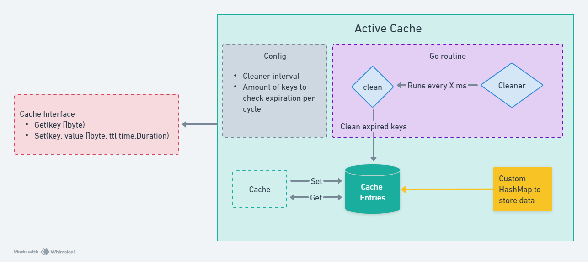
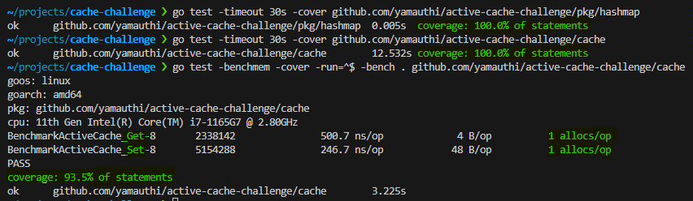

# Active strategy cache challenge

## Overview
This project was developed with software best practices in mind, like SOLID principles.
### Definition and Requirements

Develop a cache that supports TTL with an active strategy instead of a lazy strategy (or passive).
You can read more about lazy vs active removing [here](https://www.pankajtanwar.in/blog/how-redis-expires-keys-a-deep-dive-into-how-ttl-works-internally-in-redis).

- [x] 1. The cache should support a string-like type as key and a byte slice as value.  
- [x] 2. You can't use a `map` or an external library. You must create your own data structure. 
- [x] 3. The cache functions can't produce more than 1 allocation per operation.
- [x] 4, The code must come with a benchmark (in order to check for the allocations).

The cache should satisfy the following interface:
```go
type Cache interface {
	// Set will store the key value pair with a given TTL.
	Set(key, value `[]byte`, ttl time.Duration)

	// Get returns the value stored using `key`.
	//
	// If the key is not present value will be set to nil.
	Get(key `[]byte`) (value `[]byte`, ttl time.Duration)
}
```



### Assumptions and comments
- About the requirement *"1. The cache should support a string-like type as key(...)"* the key attribute is not an explicit string type in order to keep the defined Cache interface signature
- If TTL is negative then the key expires instantly
- Improvements ideas:
  - Cache max entries
  - Cache max memory usage
  - Eviction policies (LRU, LFU)
  - Fuzzing tests
- Go version `1.21.1`
- Go module `github.com/yamauthi/active-cache-challenge`
  - Despite the module name above, it is just for having a unique name and it also is the pattern I personally use on my projects.

## Tests
Commands used for testing
```go
go test -timeout 30s -cover github.com/yamauthi/active-cache-challenge/pkg/hashmap
go test -timeout 30s -cover github.com/yamauthi/active-cache-challenge/cache
go test -benchmem -cover -run=^$ -bench . github.com/yamauthi/active-cache-challenge/cache
```



## Structs and Functions
### Package `cache`
#### Constants
```go
const (
//-- Cleaner
  // Default Cleaner interval in ms
	DefaultCleanerInterval   = 200
  
  // Default amount of keys to check is expired per cycle
	DefaultKeysAmountByCycle = 20

  // Percentage tolerance of expired keys among the sample
	ExpiredKeysPercentageTolerance = 25

  // Minimum cleaner interval value
	MinCleanerInterval   = 50

  // Minimum amount of keys to check is expired per cycle
	MinKeysAmountByCycle = 5

//-- Expiration
  //Value for no expiration TTL
	NoExpiration = 0
)
```
#### ActiveCache
Implementation of `Cache interface` with active cleaning strategy.
  - Fields
    ```go
      // Function to perform clean on expired keys
      cleanFunc func(entries *hashmap.HashMap[*cacheEntry], conf *Config)
      
      // Holds all caching configuration
      config *Config
      
      // Cache entries
      entries hashmap.HashMap[*cacheEntry]
      
      // Reports whether the cleaner is running
      isCleanerRunning atomic.Bool
      
      // Mutex for read and write lock
      mtx *sync.RWMutex
      
      // Channel for stopping cleaner
      stopChan chan interface{}
    ```
  - Functions
    ```go
    // Returns an ActiveCache pointer instance with default config values
    func NewActiveCache() *ActiveCache
  
    // Returns an ActiveCache pointer instance with config from parameter
    func NewActiveCacheWithConfig(conf *Config) *ActiveCache
  
    // Default function to perform clean algorithm
    func defaultClean(entriesMap *hashmap.HashMap[*cacheEntry], conf *Config)
  
    // Get returns Value and TTL from specified key if it exists.
    func (c *ActiveCache) Get(key []byte) ([]byte, time.Duration) 

    // Reports whether the cleaner is running
    func (c *ActiveCache) IsCleanerRunning() bool

    // Locks cache entries and perform clean function
    func (c *ActiveCache) performClean()

    // Sets value for specified Key with TTL.
    func (c *ActiveCache) Set(key, value []byte, ttl time.Duration)

    // Starts active cache cleaning inside a go routine
    func (c *ActiveCache) StartCleaner()

    // Stops active cache cleaning
    func (c *ActiveCache) StopCleaner()

    // validateAndAdjustConfig validate config parameters
    func validateAndAdjustConfig(conf *Config)
    ```
#### CacheEntry
Represents a single cache entry with Value and TTL.
- Definition
  ```go
  type cacheEntry struct
  ```

- Fields
  ```go
  // Entry value
  Value []byte

  // Entry duration time
  Ttl time.Duration

  // Expiration time in nanoseconds
  ExpiresAt int64
  ```

- Functions
  ```go
  // Returns an empty value (nil) and TTL (0)
  func emptyValueTTL() ([]byte, time.Duration)
  
  // Returns the value and TTL
  func (c *cacheEntry) GetValueTTL() ([]byte, time.Duration)
  
  // Reports whether the cache entry is expired or not
  func (c *cacheEntry) IsExpired() bool
  ```

#### Config
Holds cache configuration parameters values.
- Definition
  ```go
  type Config struct
  ```

- Fields
  ```go
  // Interval in ms that cleaner will run
  CleanerInterval int

  // Amount of keys that will be checked per cycle
  KeysAmountByCycle int
  ```

### Package `hashmap`
#### Constants
```go
const DefaultTableSize = 10
```

#### HashMap
Simple HashMap Key - Value pair implementation using generic type to store value.
- Definition
  ```go
  type HashMap[V any] struct
  ```

- Fields
  ```go
  // Structure to hold hash table index partitions and entries
  data [DefaultTableSize][]*entry[V]

  // Used to calculate hash for keys 
  hash maphash.Hash
  ```

- Functions
  ```go
  // Delete removes the entry with key `key` if exists
  func (h *HashMap[V]) Delete(key []byte)

  // Get returns the value stored using `key`.
  func (h *HashMap[V]) Get(key []byte) (V, bool)

  // GetAll returns all stored keys as an array of `V`.
  func (h *HashMap[V]) GetAll() []entry[V]

  // Put stores `value` into hashmap with specified `key`
  func (h *HashMap[V]) Put(key []byte, value V)

  // Resets the hash bytes and write new ones
  func (h *HashMap[V]) resetAndWriteHash(k []byte)
  ```
#### Entry
Represents a hashmap entry with key value pair
- Definition
  ```go
  type entry[V any] struct
  ```
- Fields
  ```go
  // Generated key based on hash function
  HashKey uint64
  
  // Original key
  Key     []byte
  
  // Value to be stored
  Value   V
  ```

## Project structure
- cache
  - `cache.go`: ActiveCache implementation of interface Cache and auxiliary functions.
  - `cache_entry.go`: Represents a cache entry. Stores only `[]byte` values
  - `config.go`: Parameters to configure cache behaviors
  - `interface.go`: Cache interface defined in the exercise scope
- pkg
  - `hashmap.go`: Simple hashmap implementation. Can store data from any type

<sub>Author: Hugo Yamauthi Silva</sub>